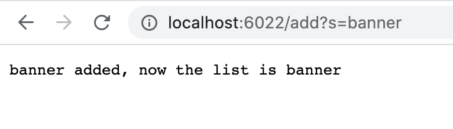

# Part 1

# This is my code for searchEngine
```
class Handler implements URLHandler {
    
    int num = 0;
    ArrayList<String> listOfString = new ArrayList<String> ();

    public String getList(ArrayList<String> someList){
        
        if(someList.size() == 0){
            return "empty list";
        }
        String temp = someList.get(0);
        for(int i = 1; i < someList.size(); i++){
            temp = temp + ", " + someList.get(i);
        }
        return temp; 
    }
    public String handleRequest(URI url) {
        if (url.getPath().equals("/")) {
            if(listOfString.size()!= 0){
                return new Handler().getList(listOfString);
            }
            return "empty list";
        } 

        else if (url.getPath().equals("/add")) {
            String[] s = url.getQuery().split("=");
            if(s[0].equals("s")){
                listOfString.add(s[1]);
                return s[1] + " added, now the list is " + new Handler().getList(listOfString);
            }
            return new Handler().getList(listOfString);
        } 

        else if (url.getPath().equals("/search")) {
            String[] s = url.getQuery().split("=");
            ArrayList<String> searchList = new ArrayList<String>();
            if(s[0].equals("s")){
                for(int i = 0; i < listOfString.size(); i++){
                    if(listOfString.get(i).contains(s[1])){
                        searchList.add(listOfString.get(i));
                    }
                }
                return new Handler().getList(searchList);
            }
        else{
            return "Query not found";
        }

        } 

        else {
            return "404 Not Found!";
        }
    }
}
```

# Terminal Commands


First is using add method:

1. add method: add "banner"

2. add method: add "banana"

3. add method: add "hey"


Relevent variables:
- String[] s, this is used to store the value being added
- ArrayList<String> listOfStrings, this is used to store all of the values that have been added

Relevent methods:
- .getPath(), returns the path of current link
- .equals(), compares two string, return true if same, false if not same.
- .split(), used to split the query by "="
- .getQuery(), returns the query of the current path
- .get(), gets the variable at that index
- .add(), adding the string to the list
- new Handler().getList(), prints the list of strings out separated by commas


Then we use the query method:

4. query method: search "ban"


Relevent variables:
- String[] s, used to store the values being searched
- ArrayList<String> listOfStrings, this is the list of strings that are all added
- int i, used in the for loop

Relevent methods:
- .getPath(), returns the path of current link
- .equals(), compares two string, return true if same, false if not same
- .split(), used to split the query by "="
- .getQuery(), returns the query of the current path
- .get(), gets the variable at that index
- .add(), adding the string to the list
- .size(), used so the for loop stops when all strings are checked
- .contains(), used to check if string contains what it is searching
- new Handler().getList(), prints the list of strings out separated by commas

# Part 2
# First Bug
The failure-inducing input:
```
 @Test
  public void testAverage2(){
    double[] input2  = {1, 1, 2, 3};
    assertEquals(2, ArrayExamples.averageWithoutLowest(input2), 0);
  }
```
The symptom:
```
JUnit version 4.13.2
.E
Time: 0.01
There was 1 failure:
1) testAverage2(ArrayTests)
java.lang.AssertionError: expected:<2.0> but was:<1.6666666666666667>
        at org.junit.Assert.fail(Assert.java:89)
        at org.junit.Assert.failNotEquals(Assert.java:835)
        at org.junit.Assert.assertEquals(Assert.java:555)
        at org.junit.Assert.assertEquals(Assert.java:685)
        at ArrayTests.testAverage2(ArrayTests.java:47)

FAILURES!!!
Tests run: 1,  Failures: 1
```
The bug:
```
static double averageWithoutLowest(double[] arr) {
    if(arr.length < 2) { return 0.0; }
    double lowest = arr[0];
    for(double num: arr) {
      if(num < lowest) { lowest = num; }
    }
    double sum = 0;
    for(double num: arr) {
      if(num != lowest) { sum += num; }
    }
    return sum / (arr.length - 1);
  }
  ```

after fixing:
```
static double averageWithoutLowest(double[] arr) {
    if(arr.length < 2) { return 0.0; }
    double lowest = arr[0];
    int index = 0;
    for(int i = 0; i < arr.length; i++) {
      if(arr[i] < lowest) { lowest = arr[i]; index = i;}
    }
    double sum = 0;
    for(int i = 0; i <arr.length; i++) {
      if(i != index) { sum += arr[i]; }
    }
    return sum / (arr.length - 1);
  }
  ```
The problem that this code has is that it takes out one lowest double, but when there are multiple doubles that is the same as that lowest double, a problem occurs. It is suppose to only take out one of all the lowest doubles, but it takes out all of the lowest doubles that are the same. The bug is the if statement, it takes out all values that are equal to lowest. What I did to fix this is copying the index of lowest double, then only taking out that double and adding everything else when doing the sum.

# Second bug

The failure-inducing input:
```
@Test
    public void testFilter1() {
        List<String> list1 = new ArrayList<String> (); 
        List<String> list2 = new ArrayList<String> ();
        list1.add("s");
        list1.add("ss");
        list1.add("a");
        list2.add("s");
        list2.add("ss");
        assertEquals(list2, ListExamples.filter(list1, new FilterS()));  
    }
```
here is my stringChecker just for a reference: it takes out all strings that does not contain "s"
```
public class FilterS implements StringChecker{
    public boolean checkString(String s){
        if(s.contains("s")){
            return true;
        }
        else{
            return false;
        }
    }
}
```
The symptom:
```
JUnit version 4.13.2
.E
Time: 0.009
There was 1 failure:
1) testFilter1(ListTests)
java.lang.AssertionError: expected:<[s, ss]> but was:<[ss, s]>
        at org.junit.Assert.fail(Assert.java:89)
        at org.junit.Assert.failNotEquals(Assert.java:835)
        at org.junit.Assert.assertEquals(Assert.java:120)
        at org.junit.Assert.assertEquals(Assert.java:146)
        at ListTests.testFilter1(ListTests.java:19)

FAILURES!!!
Tests run: 1,  Failures: 1
```
The bug:
```
static List<String> filter(List<String> list, StringChecker sc) {
    List<String> result = new ArrayList<>();
    for(String s: list) {
      if(sc.checkString(s)) {
        result.add(0, s);
      }
    }
    return result;
  }
```
After fixing:
```
static List<String> filter(List<String> list, StringChecker sc) {
    List<String> result = new ArrayList<>();
    for(String s: list) {
      if(sc.checkString(s)) {
        result.add(s);
      }
    }
    return result;
  }
```
The bug is that when adding the strings into the array list with the completely opposite order. The bug is at the result.add(0, s). This adds to the front of the array instead. After fixing, changing to result.add(s), the result is in the correct order.
