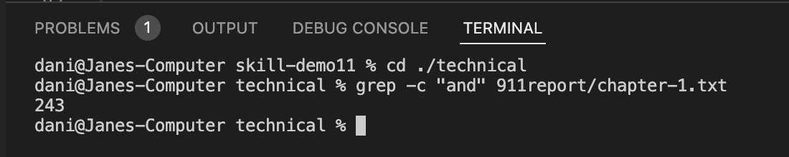
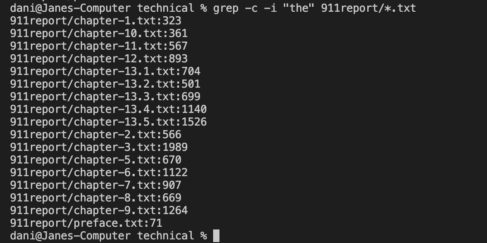
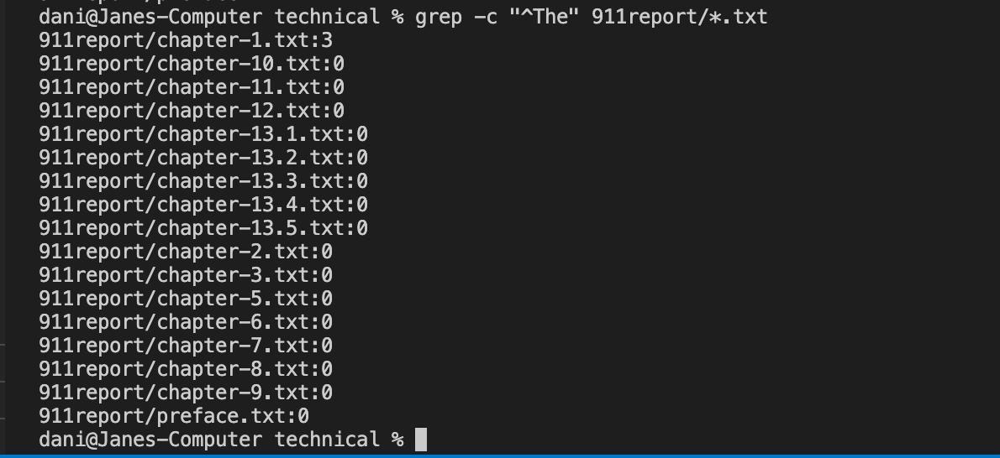
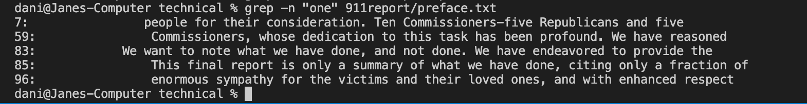
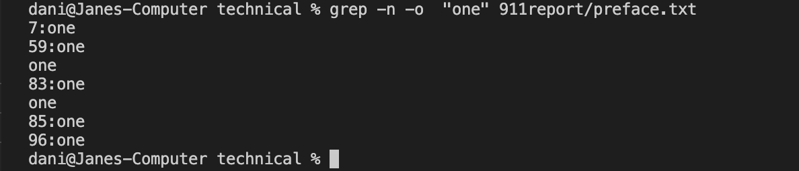
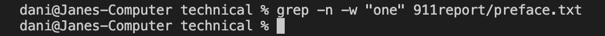
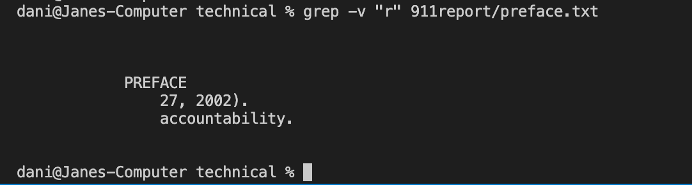
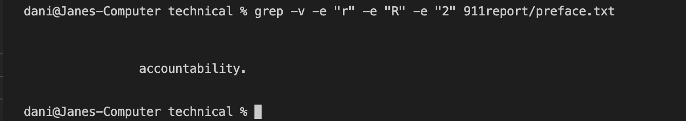
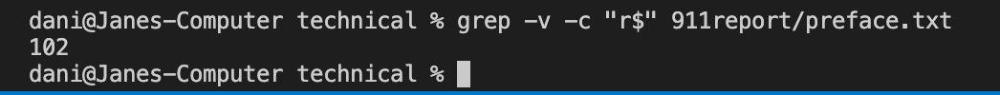

# First command line option: grep -c
## Example 1:

This search for how many lines contain the string “and” in 911report/chapter-1.txt.. This can be useful when we want to know how many lines in a specific file match our criteria.

## Example 2:

This is a little different from example 1 because I’m not only searching for lines with that pattern in a specific file, but all files in the 911report/*.txt pattern. The additional -i is for ignoring the case sensitive criteria, this way “the”, “The”, and “THE” will all be counted. This is useful when you want to count all lines with any form of strings spelled with t-h-e.

## Example 3:

This time, I searched for “^The”, but the ^ symbol is not a string, it means searching for lines that start with “The” in files matching the pattern of 911report/*.txt. This is useful when you are counting more case specific lines.

# Second command line option: grep -n
## Example 1:

-n gives all line number that match the certain pattern. This is going to be useful when you are not just looking for lines that match a pattern, but also what that line is and where that line is.

## Example 2:

-o will shorten the lines and only give the string as outcome. This will be useful when you are only interested in the line number but not the lines, making it less complicated and less things to look at. Moreover, it shows how many times the pattern popped up in that line, like in line 59 and 83 “one” popped up twice.

## Example 3:

-w prints lines only if the whole string matches, so string “done” won’t be counted when the pattern is “one”. This makes the cases more specific and accurate if your looking for a single string, in this case, there is no matching result, all of the lines that showed up in the previous two commands are line with string that contains “one” but the whole string is not “one”.

# Third command line option: grep -v
## Example 1:

-v gives all lines that doesn’t match a certain pattern, so only lines in 911report/preface.txt that doesn’t include string “r” is given. One case for this to be useful would be say you are looking for people with the wrong answer, then you would do -v “the right answer” and find those lines.

## Example 2:

The -e specifies multiple cases that is going to be part of the criteria, this will be useful when you want to find multiple patterns of strings instead of just one.

## Example 3:

The $ in “r$” is similar to the ^ in previous examples, where it isn’t a string that is being searched as a pattern, but it means lines that end with string “r”. The -c is there because the result is too long so I simplified it to give the counts of lines that don't end with “r”. This will be useful when looking for lines that end with a certain pattern. 