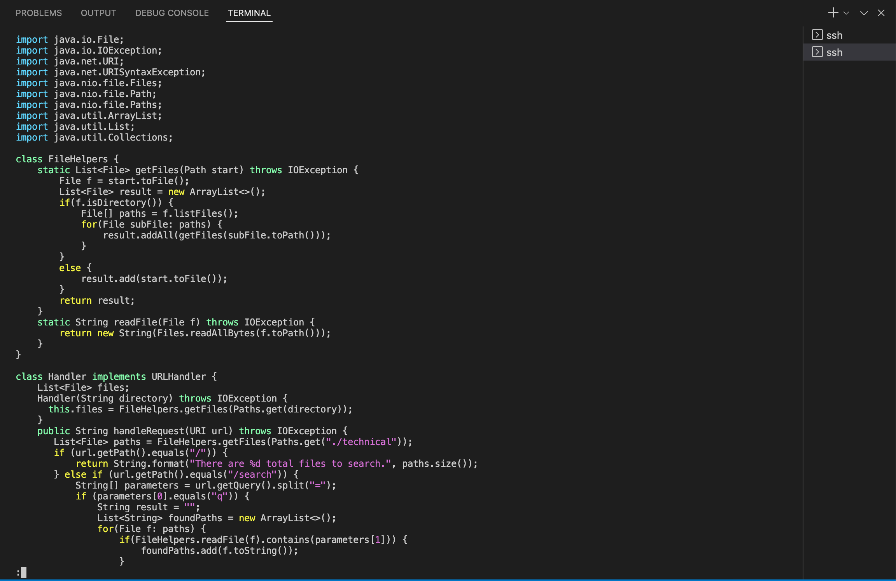
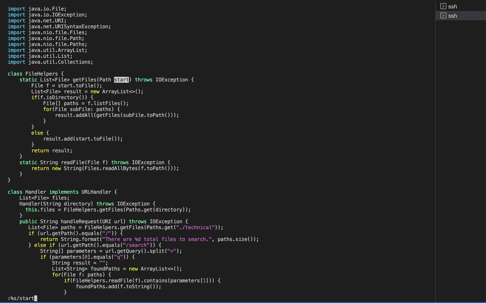
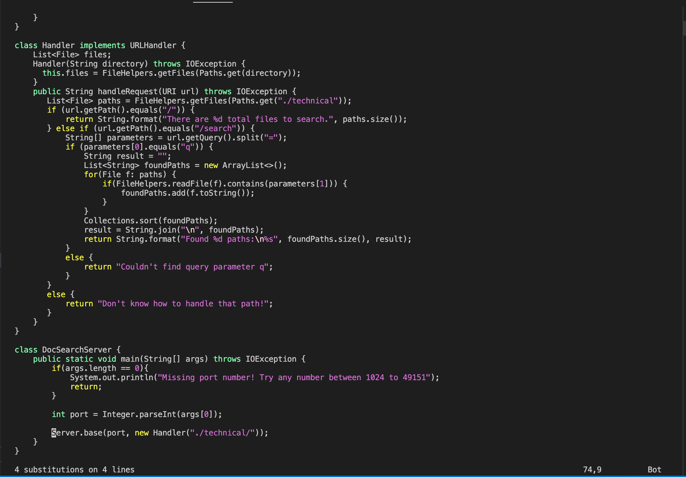
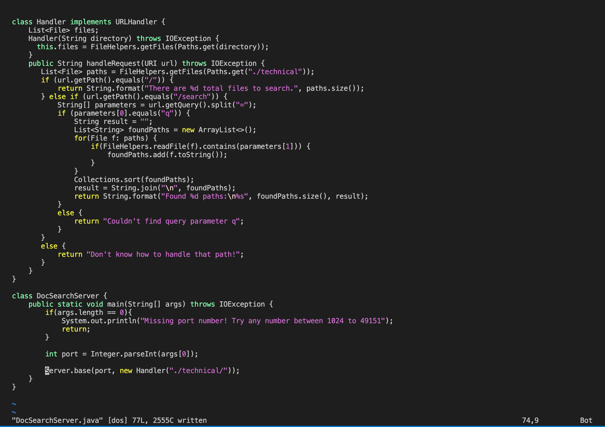

# First Task
## Task Chose: 
In DocSearchServer.java, change the name of the start parameter of getFiles, and all of its uses, to instead be called base.
## Shortest vim Command:
:%s/start/base < enter > < ESC > :w

total of 17 keypresses
- First cursor move:
the ":" keypress removed the cursor and waits to change the mode

- Second cursor move:
the "%s/start" keypresses searched for all "start" in this file and moved the cursor to highlight the first "start" in the file

- Third cursor move/changed the text:
the "/base < enter >" keypresses deleted all the "start" in the file and replaced them with "base"

- Last cursor move:
the "< ESC > :w" goes back to normal mode and saves the changes

