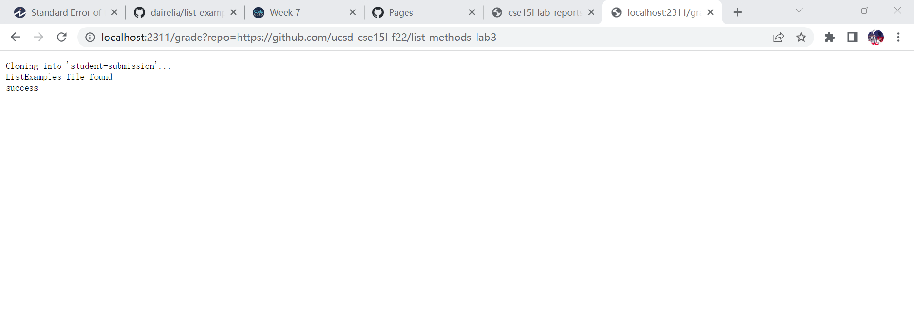
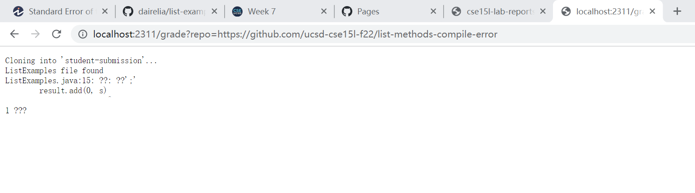
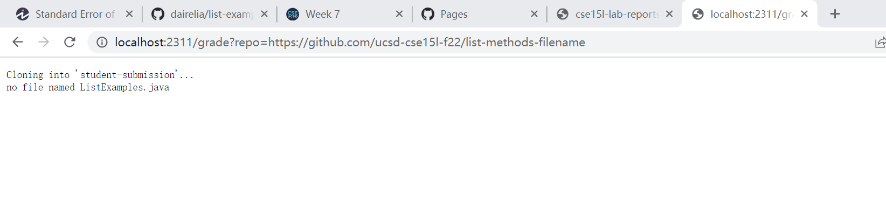

# Lab Report 5
## grade.sh Code Block
```
# Create your grading script here
set -e

rm -rf student-submission
git clone $1 student-submission

cd student-submission # go into student-sub to look for listexamples

if [[ -f ListExamples.java ]]
then 
    echo "ListExamples file found"
else 
    echo "no file named ListExamples.java"
    exit
fi

cd .. # go back to copy testlistexamples into studentsubmission

cp TestListExamples.java student-submission
cp -R lib/ student-submission

# checking if lib is in student-sub
cd student-submission
#...

set +e

javac -cp .:lib/hamcrest-core-1.3.jar:lib/junit-4.13.2.jar *.java
javac -cp .:lib/hamcrest-core-1.3.jar:lib/junit-4.13.2.jar *.java 2> error.txt
if [[ $? -eq 0 ]]
then
	echo "success"
else
	cat error.txt
	exit 1
fi
```

## 3 Screenshots




## Trace:
1. 
``` 
set -e 
```
Exits whenever a command exits with a nonzero status

2. 
```
rm -rf student-submission
```
forces to removes student-submission directory if it was previously made

3. 
```
git clone $1 student-submission
```
git clone whatever student submited that is after "=" into a new directory called student-submission


4. 
```
cd student-submission # go into student-sub to look for listexamples
```
change directories into student-submission

5. 
```
if [[ -f ListExamples.java ]]
    then 
        echo "ListExamples file found"
    else 
        echo "no file named ListExamples.java"
        exit
    fi
```
checks if ListExamples.java is in the directory student-submission, in this case, the file ListExamples.java was not found, so the else statement goes through and echos "no file named ListExamples.java" and exits. 

6. 

```
cd .. # go back to copy testlistexamples into studentsubmission


cp TestListExamples.java student-submission
cp -R lib/ student-submission

cd student-submission

set +e

avac -cp .:lib/hamcrest-core-1.3.jar:lib/junit-4.13.2.jar *.java
javac -cp .:lib/hamcrest-core-1.3.jar:lib/junit-4.13.2.jar *.java 2> error.txt
if [[ $? -eq 0 ]]
then
	echo "success"
else
	cat error.txt
	exit 1
fi
```
rest of the codes will not run because we had already exited bash.