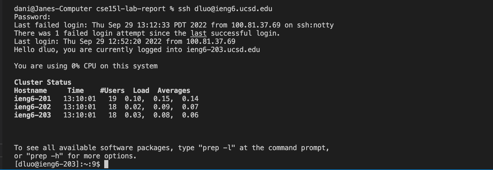

# Steps to Set Up SSH on Your Computer

1. Installing VS Code:
- Download VS Code from online and Install it on your computer
- Open VS Code

2. Remotely Connecting:
- Open the terminal in VSCode by going to Terminal>New Terminal at the top
- Type: ssh cs15lfa22qp@ieng6.ucsd.edu, where qp can be changed to whatever your username is, or type dluo@ieng6.ucsd.edu if that didn’t work
- Type in your password afterward
- If it asks for "yes/no/[fingerprint]" answer yes

3. Now Try Some Commands:
- Try out commands like cd, ls, pwd...

4. Moving Files With SCP
- First create a local file, I named it as WhereAmI.java
- Log in to ssh
- Check where current directory is, and use cd to change to place where the file is
- Use scp WhereAmI.java dluo@ieng6.ucsd.edu:~/ to move files into a remote directory

5. Setting an ssh Key
- First exit ssh, then put in ssh-keygen. There press enter to specify default path
- log into your ssh account, and enter "mkdir .ssh"
- Afterwards, put this in: /Users/dani/.ssh/id_rsa.pub/dluo@igen6.ucsd.edu:~/.ssh/authorized_keys

- Image below shows logging in without password

6. Optimizing Remote Running
- One can optimize remote running by doing multiple actions at once
- I still couldn't run using the cs15lfa22qp@ieng6.ucsd.edu account, there's is still a problem for some reason 
